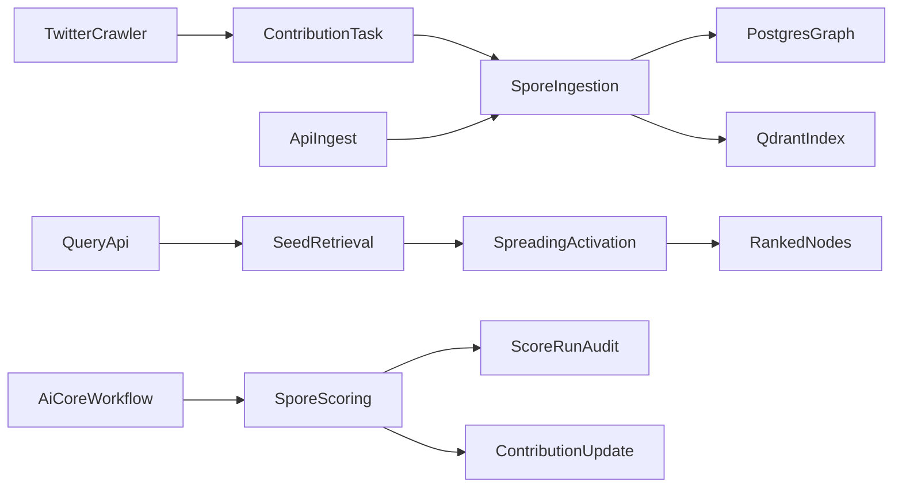

# SPORE_LEARN

This is the fast, practical learning path for understanding the SPORE AI revamp.

Use this if you want to go from zero context to confidently editing the system.

---

## 0) What You Are Learning

The SPORE revamp turns a text-only judge into a hybrid intelligence system:

1. ingest multi-source signals
2. persist graph structure in Postgres
3. index content vectors in Qdrant
4. extract relationship features (ex: Twitter account A vs B)
5. compose final score from text + graph variables

---

## 1) 30-Minute Learning Path

### Step A (5 min): Understand the surface area

Read in this order:

1. `backend/apps/spore/urls.py`
2. `backend/apps/spore/views.py`
3. `backend/apps/ai_core/workflow.py`
4. `backend/apps/contributions/crawlers.py`
5. `backend/apps/contributions/tasks.py`

Goal: see the runtime flow from API/crawler -> graph -> scoring.

### Step B (10 min): Understand storage and contracts

Read:

1. `backend/apps/spore/models.py`
2. `backend/apps/spore/types.py`
3. `backend/apps/spore/services/scoring.py`

Goal: know exactly what gets stored and how scoring is composed.

### Step C (10 min): Understand intelligence internals

Read:

1. `backend/apps/spore/services/ingestion.py`
2. `backend/apps/spore/services/graph.py`
3. `backend/apps/spore/services/qdrant.py`
4. `backend/apps/spore/services/embedding.py`

Goal: understand retrieval, activation, and relationship-variable extraction.

### Step D (5 min): Run tests as a checkpoint

```bash
cd backend
DATABASE_URL="sqlite:////tmp/airdrop_spore_test.db" REDIS_URL="redis://localhost:6379/0" DJANGO_ENV=local uv run pytest apps/spore/tests apps/ai_core/tests/test_workflow.py apps/contributions/tests/test_crawler_views.py -q
```

If this passes, you have a stable baseline.

---

## 2) System Map (Mental Model)



Keep this in mind:

- `contributions/*` is upstream ingestion trigger logic.
- `spore/*` is graph + retrieval + scoring intelligence.
- `ai_core/workflow.py` is still the compatibility entry point for scoring jobs.

---

## 3) Core Concepts by File

### A) Graph schema

- `backend/apps/spore/models.py`
  - `GraphNode`: account/content/entity/signal
  - `GraphEdge`: weighted typed links (`mentions`, `reply_to`, `semantic`, etc.)
  - `Observation`: normalized event facts
  - `ScoreRun`: explainability + confidence audit records

### B) SPORE typed contracts

- `backend/apps/spore/types.py`
  - dataclass contracts for node/edge/context/score-vector structures

### C) Ingestion pipeline

- `backend/apps/spore/services/ingestion.py`
  - `ingest_content(...)`
  - `record_twitter_item(...)`
  - `sporulate_recent_nodes(...)`
  - `query_seed_nodes_by_text(...)`

### D) Graph intelligence

- `backend/apps/spore/services/graph.py`
  - upsert helpers
  - spreading activation
  - pair relationship feature extraction

### E) Scoring composer

- `backend/apps/spore/services/scoring.py`
  - merges judge text score + graph feature component
  - emits confidence + explainability
  - writes `ScoreRun`

### F) Legacy-compatible workflow

- `backend/apps/ai_core/workflow.py`
  - `run_scoring_pipeline(...)` now uses SPORE v2 scoring internally
  - still updates contribution fields + XP in expected format

---

## 4) Hands-On API Walkthrough

All endpoints are under `/api/v1/spore/`.

### Ingest content

`POST /api/v1/spore/ingest/`

```json
{
  "source_platform": "manual",
  "external_id": "learn-1",
  "text": "Community post about graph scoring and trust signals",
  "metadata": {
    "topic": "spore-learning"
  }
}
```

### Query graph retrieval

`POST /api/v1/spore/query/`

```json
{
  "query_text": "trust signals between accounts",
  "hops": 2,
  "damping": 0.65,
  "top_k": 10
}
```

### Relationship summary (Twitter pair)

`GET /api/v1/spore/relationships/twitter/?account_a=alice&account_b=bob&days=30`

Use this endpoint to inspect pairwise graph variables directly.

### Phase 3 stub generation

`POST /api/v1/spore/briefs/generate/`

Requires:

- `SPORE_ENABLE_PHASE3=true`

---

## 5) Environment Switches to Know

In the root `.env`:

- `SPORE_QDRANT_ENABLED` -> enable vector indexing/search
- `SPORE_QDRANT_URL` -> Qdrant URL
- `SPORE_QDRANT_COLLECTION` -> collection name
- `SPORE_ACTIVATION_TTL_SECONDS` -> activation cache TTL
- `SPORE_SPORULATION_BEAT_MINUTES` -> periodic semantic edge refresh
- `SPORE_ENABLE_PHASE3` -> brief-generation stub gate

In Docker:

- `qdrant` service is defined in `docker-compose.yml`

---

## 6) Common Editing Tasks (with starting files)

### Add a new relationship variable

Start at:

- `backend/apps/spore/services/graph.py` (`twitter_pair_relationship_features`)
- `backend/apps/spore/services/scoring.py` (consume new variable in score vector)

### Add another source type

Start at:

- `backend/apps/contributions/crawlers.py`
- `backend/apps/contributions/tasks.py`
- `backend/apps/spore/services/ingestion.py`

### Change scoring weights

Start at:

- `backend/apps/spore/services/scoring.py`

### Change retrieval behavior

Start at:

- `backend/apps/spore/services/ingestion.py` (`query_seed_nodes_by_text`)
- `backend/apps/spore/services/graph.py` (`spreading_activation`)

---

## 7) Validation Checklist After Any Change

1. Lint:

```bash
cd backend
uv run ruff check apps/spore apps/contributions apps/ai_core/workflow.py config/settings/base.py
```

2. Tests:

```bash
cd backend
DATABASE_URL="sqlite:////tmp/airdrop_spore_test.db" REDIS_URL="redis://localhost:6379/0" DJANGO_ENV=local uv run pytest apps/spore/tests apps/ai_core/tests/test_workflow.py apps/contributions/tests/test_crawler_views.py -q
```

3. Migration check (if model changes):

```bash
cd backend
DATABASE_URL="sqlite:////tmp/airdrop_spore_test.db" DJANGO_ENV=local uv run python manage.py makemigrations --check --dry-run
```

---

## 8) Next Learning Step

When you finish this file, read `SPORE_READ_Me.md` for deeper implementation detail and longer operational notes.

